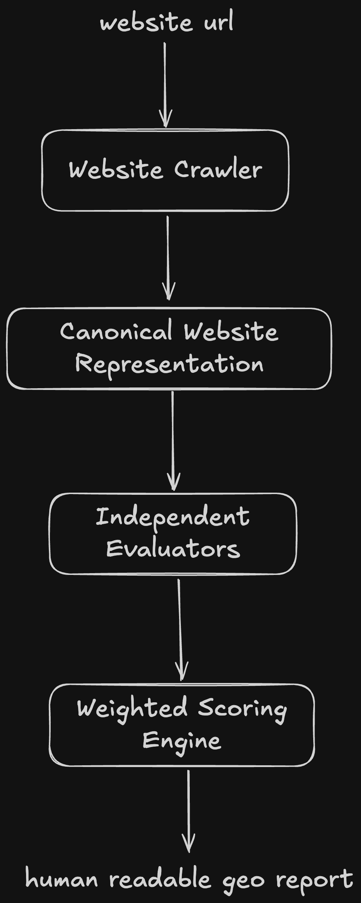
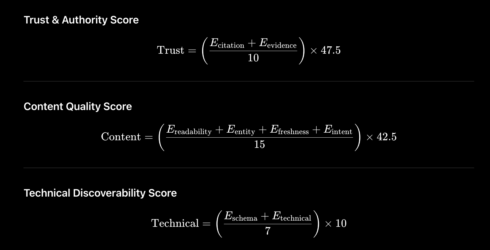

# GEO Auditor

> A framework for evaluating how well websites are optimized for Generative Engine Optimization (GEO) using a combination of deterministic analysis and LLM-based semantic evaluation.

---

# Overview

GEO Auditor crawls a website, constructs a Canonical Website Representation (CWR), evaluates it across multiple GEO dimensions, and produces a weighted GEO score together with a detailed audit report.

The framework is designed around two principles:

- Every evaluation criterion should be independently measurable.
- LLMs should only receive structured, relevant information instead of raw HTML.

---

# Getting Started

The project consists of two repositories:

- **Backend (this repository)** – GEO crawling, evaluation, scoring, and report generation.
- **Frontend** – User interface for submitting websites and viewing audit reports.

## Backend Setup

### 1. Install dependencies

```bash
pip install -r requirements.txt
```

### 2. Create environment variables

Copy the example environment file.

```bash
cp .env.example .env
```

Update the values as required.

### 3. Run the backend

```bash
python app/main.py
```

The backend will start locally and expose the GEO audit API.

---

## Frontend Setup

Frontend repository:

**https://github.com/haideraqeeb/geo-audit-frontend**

### 1. Clone the frontend repository

```bash
git clone https://github.com/haideraqeeb/geo-audit-frontend.git
cd geo-audit-frontend
```

### 2. Create environment variables

```bash
cp .env.example .env
```

Configure the backend API URL if necessary.

### 3. Install dependencies

```bash
npm install
```

### 4. Start the development server

```bash
npm run dev
```

The frontend will connect to the locally running backend and provide the GEO audit interface.

---

# Architecture

<p align="center">
  
</p>


---

## Design Decisions

The goal of GEO Auditor is to provide a practical framework for evaluating websites for Generative Engine Optimization rather than building a production-scale crawler.

### What was built

- Website crawler with configurable crawl limits
- Canonical Website Representation (CWR)
- Deterministic technical analysis
- LLM-based semantic evaluators
- Weighted GEO scoring framework
- Confidence estimation
- Layered audit report generation
- Interactive frontend for submitting audits and viewing reports

### What was intentionally left out

To keep the project focused and maintainable, several production features were intentionally omitted.

- Distributed crawling infrastructure
- Persistent storage for crawl history
- Authentication and user accounts
- Incremental recrawling
- Report versioning
- Background job queues
- Multi-domain batch auditing
- Caching across audit sessions

These features improve scalability but do not contribute directly to demonstrating the GEO evaluation framework itself.

---

## Real vs Mocked

### Real

- Website crawling
- HTML parsing
- Metadata extraction
- robots.txt parsing
- Sitemap discovery
- JSON-LD extraction
- Internal and external link analysis
- Canonical Website Representation generation
- Deterministic GEO evaluation
- LLM-based semantic evaluation
- Weighted scoring
- Confidence computation
- Markdown report generation
- Frontend and backend integration

### Mocked

- None.

All evaluator outputs are generated from live website content using deterministic analysis or LLM reasoning. No scores or recommendations are hardcoded.

---

## Future Work

With another week of development, the following improvements would be prioritized.

- Larger-scale crawling with asynchronous workers
- Incremental crawling and change detection
- Historical GEO score tracking
- Report comparison across multiple audits
- Additional GEO evaluators (multimodal content, citation graph analysis, AI answer simulation)
- Smarter prompt caching and evaluation reuse
- Batch auditing for multiple websites
- Dashboard with historical trends and analytics
- Export formats such as PDF and JSON
- User authentication and saved projects

---

# Research

The framework is built around GEO techniques that consistently appear across GEO research and established Search Central guidance.

## Final List of Important Techniques

| Technique | Relative Importance |
|------------|--------------------:|
| Citations to authoritative sources | 5 |
| Evidence-backed quantitative claims | 5 |
| Authoritative quotations | 5 |
| Readability | 4 |
| Entity richness | 4 |
| Schema.org (JSON-LD) | 4 |
| Freshness | 4 |
| User intent coverage | 3 |
| Internal linking | 3 |
| Meta tags | 3 |
| Robots.txt & Sitemap | 3 |
| llms.txt | 2 |

## Category Weights

### Trust & Authority (47.5%)

- Citation authority
- Evidence-backed quantitative claims

### Content Quality (42.5%)

- Readability
- Entity richness
- Freshness
- User intent coverage

### Technical Discoverability (10%)

- Schema.org (JSON-LD)
- Internal linking
- Robots.txt & Sitemap
- Meta tags
- llms.txt

These relevance values were chosen based on alot of research on different GEO papers.
---

# System Design

## What is sent to the LLM?

Instead of sending raw HTML, the crawler converts everything into a structured JSON representation.

Possible inputs include:

- Structured page content
- Internal & external links
- Metadata
- Schema.org / JSON-LD
- HTTP metadata
- Crawl resources (robots.txt, sitemap, llms.txt)

Every evaluator receives only the subset of data it requires.

---

# Canonical Website Representation (CWR)

The crawler builds a single normalized JSON object containing:

- Website information
- Page content
- Links
- Metadata
- Structured data
- Crawl resources
- Temporal information

## Crawl Constraints

- Maximum depth: 2–3
- Maximum pages: 40
- Maximum representation: ~80k tokens
- Token counting using tiktoken
- Stay within the same domain

(The JSON schema from the design document should be inserted here.)

---

# Evaluation Framework

Eight independent evaluators operate on the CWR.

| Evaluator | Primary Input |
|-----------|---------------|
| Citation Authority | Paragraphs, External Links |
| Evidence Support | Paragraphs, Tables |
| Readability | Headings, Paragraphs, Lists |
| Entity Coverage | Title, Headings, Paragraphs |
| Freshness | Dates, Content, Schema, Headers |
| User Intent Coverage | Content |
| Structured Data | JSON-LD |
| Technical Discoverability | robots.txt, sitemap, metadata, llms.txt |

## Semantic vs Deterministic

### Semantic

- Citation Authority
- Evidence Support
- Readability
- Entity Coverage
- Freshness
- User Intent Coverage

### Deterministic

- Structured Data
- Technical Discoverability

Each evaluator uses an operational rubric instead of a generic scoring prompt.

---

# Scoring Algorithm

The scoring system is criteria-based and additive.

Evaluator outputs are weighted according to research importance before being aggregated into category scores.

The framework also computes evaluator confidence, category confidence, and overall confidence.

<p align="center">
  
</p>
<br>
<p align="center">
  
</p>
<br>
<p align="center">
  
</p>

Here, the numbers 10, 15 and 7 come by the addition of intra class weights of the different types of GEO optimization where highest is 5, based on each of their importance

---

# Report Structure

The generated report is layered.

### Layer 1

- Overall GEO Score

### Layer 2

- Trust & Authority
- Content Quality
- Technical Discoverability

### Layer 3

- Individual evaluator findings
- Supporting evidence
- Recommendations

---

# Evaluator Output

Every evaluator returns a common schema consisting of:

- Score
- Confidence
- Summary
- Findings
- Evidence
- Recommendations
- Metadata

This enables all evaluators to plug into the same scoring pipeline.

---

# Performance Considerations

- Prompt caching
- Parallel evaluator execution
- Token budgeting
- Crawl limits
- Domain restriction
- Structured inputs to reduce token usage

---

# Implementation Pipeline

1. Crawl website
2. Build Canonical Website Representation
3. Run deterministic checks
4. Run semantic evaluators
5. Aggregate weighted scores
6. Compute confidence
7. Generate layered GEO report
